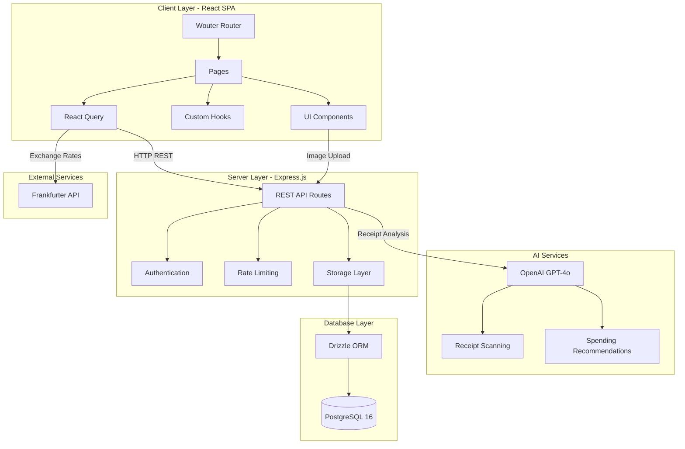
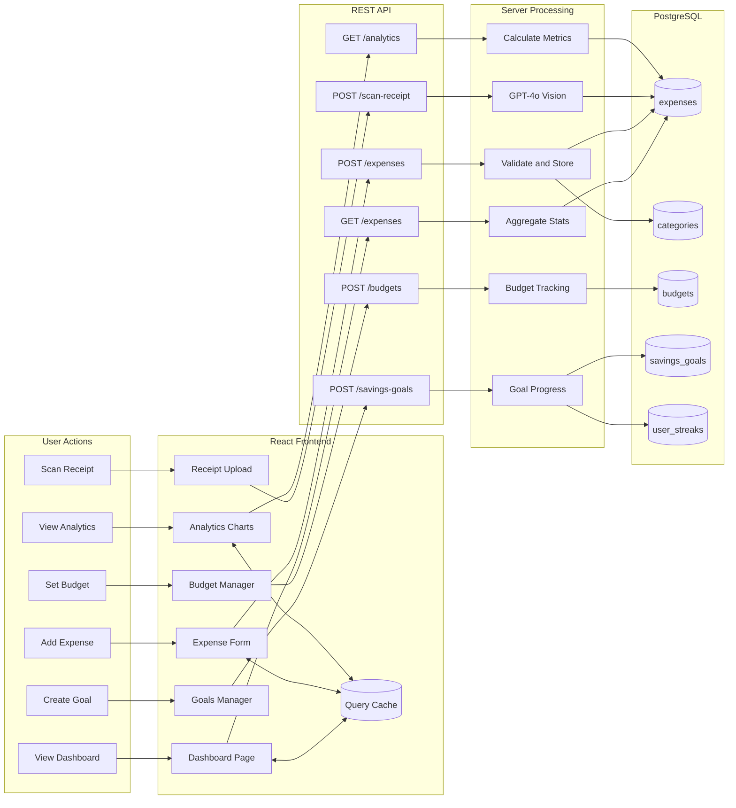
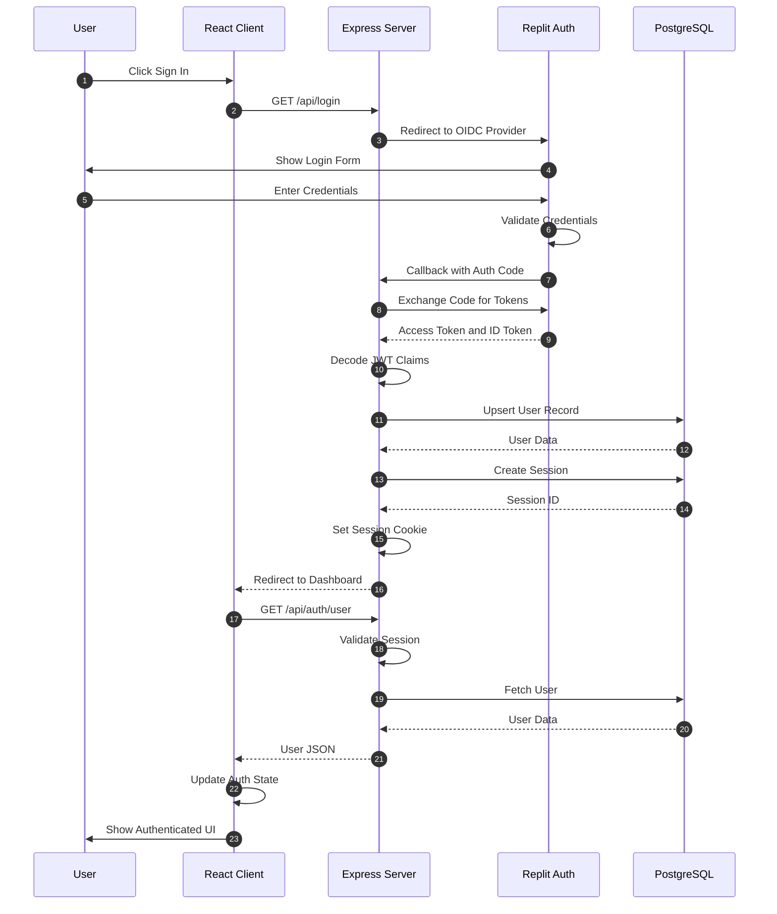
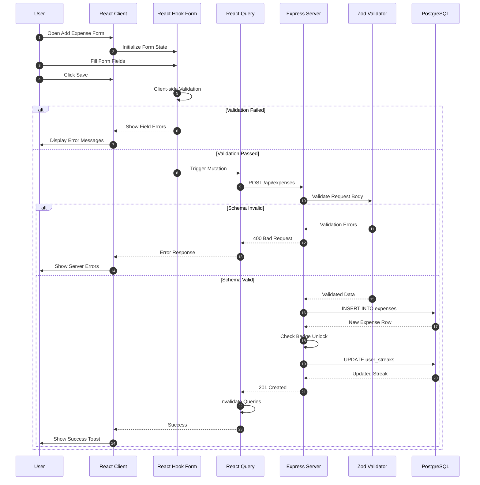
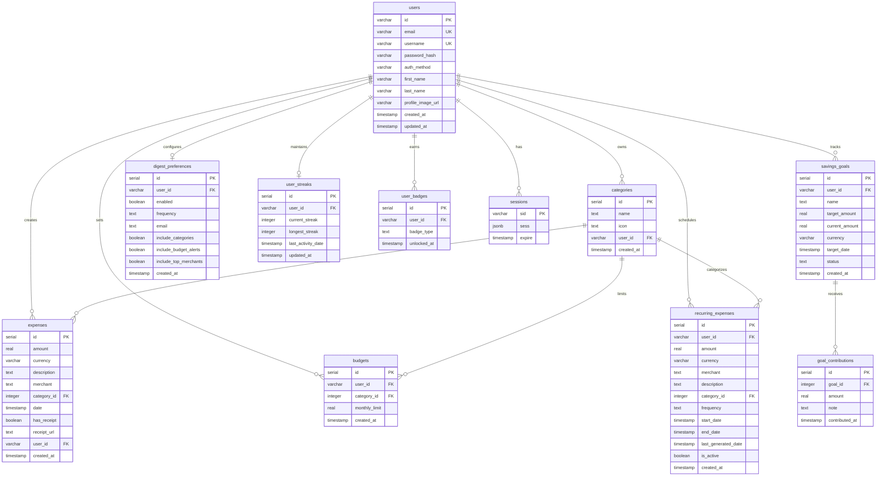

# ExpenseTracker Architecture Diagrams

> Generated: February 21, 2026  
> Author: Paige (Technical Writer)

This document contains comprehensive architecture diagrams for the ExpenseTracker application.

---

## Table of Contents

1. [System Architecture](#1-system-architecture)
2. [Data Flow Diagram](#2-data-flow-diagram)
3. [Authentication Sequence](#3-authentication-sequence)
4. [Receipt Scanning Sequence](#4-receipt-scanning-sequence)
5. [Expense CRUD Sequence](#5-expense-crud-sequence)
6. [Entity Relationship Diagram](#6-entity-relationship-diagram)

---

## 1. System Architecture

High-level view of the system's main containers and their interactions.

### Component Details

| Layer | Technology | Purpose |
|-------|------------|---------|
| **Frontend** | React 18, Vite, TypeScript | Single Page Application |
| **UI Library** | Radix UI, shadcn/ui, Tailwind CSS | Accessible components |
| **State** | TanStack React Query | Server state caching |
| **Routing** | Wouter | Client-side routing |
| **Backend** | Express.js, Node.js | REST API server |
| **Database** | PostgreSQL 16, Drizzle ORM | Data persistence |
| **Auth** | Replit Auth OIDC, bcrypt | Identity management |
| **AI** | OpenAI GPT-4o Vision | Receipt scanning |
| **Rate Limiting** | express-rate-limit | API protection |

---

## 2. Data Flow Diagram

Shows how data flows through the application for key operations.

---

## 3. Authentication Sequence

Sequence diagram showing the authentication flow using Replit Auth (OIDC).

---

## 4. Receipt Scanning Sequence

Sequence diagram showing the AI-powered receipt scanning flow.

```mermaid
sequenceDiagram
    autonumber
    participant U as User
    participant C as React Client
    participant S as Express Server
    participant RL as Rate Limiter
    participant AI as OpenAI GPT-4o
    participant DB as PostgreSQL

    U->>C: Upload Receipt Image
    C->>C: Convert to Base64
    C->>S: POST /api/scan-receipt
    S->>RL: Check AI Rate Limit
    
    alt Rate Limit Exceeded
        RL-->>S: 429 Too Many Requests
        S-->>C: Error Response
        C->>U: Show Please Wait message
    else Rate Limit OK
        RL-->>S: Allow Request
        S->>AI: Send Image for Analysis
        Note over AI: GPT-4o Vision API extracts merchant, amount, date, category
        AI-->>S: Extracted Data JSON
        S->>S: Validate and Normalize Data
        S-->>C: Parsed Receipt Data
        C->>C: Pre-fill Expense Form
        C->>U: Show Pre-filled Form
        U->>C: Confirm and Save
        C->>S: POST /api/expenses
        S->>DB: Insert Expense
        DB-->>S: Created Expense
        S-->>C: Success Response
        C->>C: Invalidate Query Cache
        C->>U: Show Success Toast
    end
```

---

## 5. Expense CRUD Sequence

Sequence diagram showing expense creation with validation.

---

## 6. Entity Relationship Diagram

Database schema showing all tables and their relationships.

---

## Key API Endpoints

| Endpoint | Method | Description |
|----------|--------|-------------|
| `/api/auth/user` | GET | Get authenticated user |
| `/api/expenses` | GET, POST | List or create expenses |
| `/api/expenses/:id` | GET, PUT, DELETE | Single expense CRUD |
| `/api/expenses/export/csv` | GET | Export expenses to CSV |
| `/api/categories` | GET, POST | List or create categories |
| `/api/budgets` | GET, POST | List or create budgets |
| `/api/savings-goals` | GET, POST | List or create goals |
| `/api/scan-receipt` | POST | AI receipt scanning |
| `/api/recommendations` | GET | AI spending insights |
| `/api/analytics/category-spending` | GET | Category breakdown |
| `/api/analytics/spending-trend` | GET | Spending over time |
| `/api/analytics/summary` | GET | Dashboard stats |

---

## Rate Limits

| Scope | Limit | Window |
|-------|-------|--------|
| Global API | 100 requests | 1 minute |
| AI Endpoints | 5 requests | 1 minute |

---

## Supported Currencies

USD, EUR, GBP, JPY, CAD, AUD, CHF, CNY, INR, MXN, PHP
