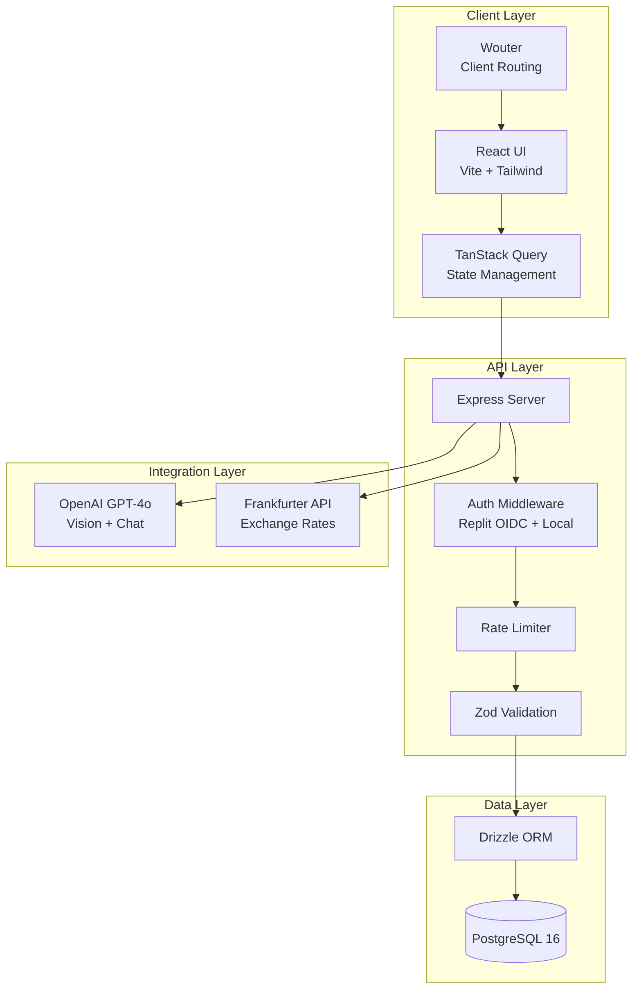
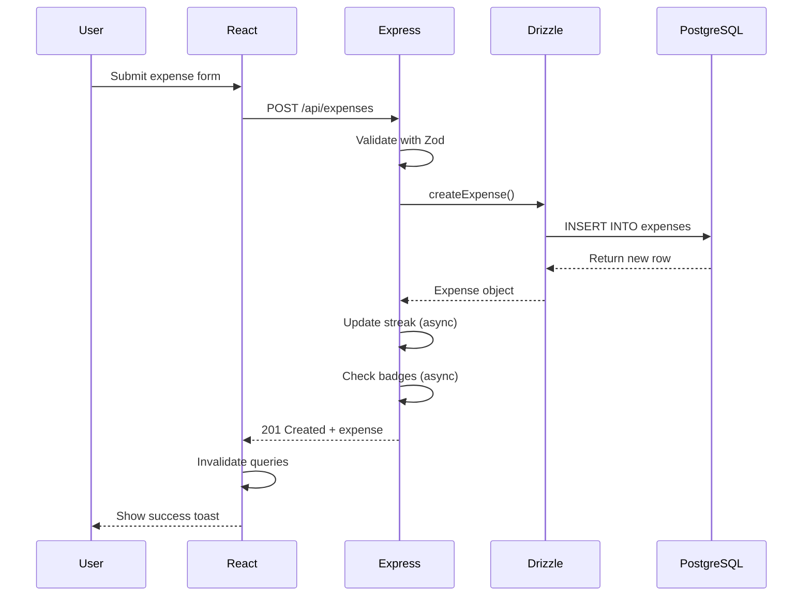
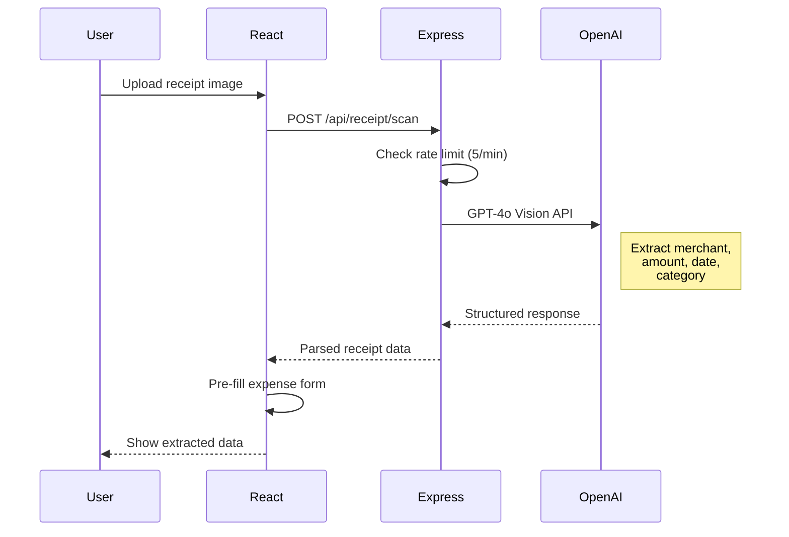
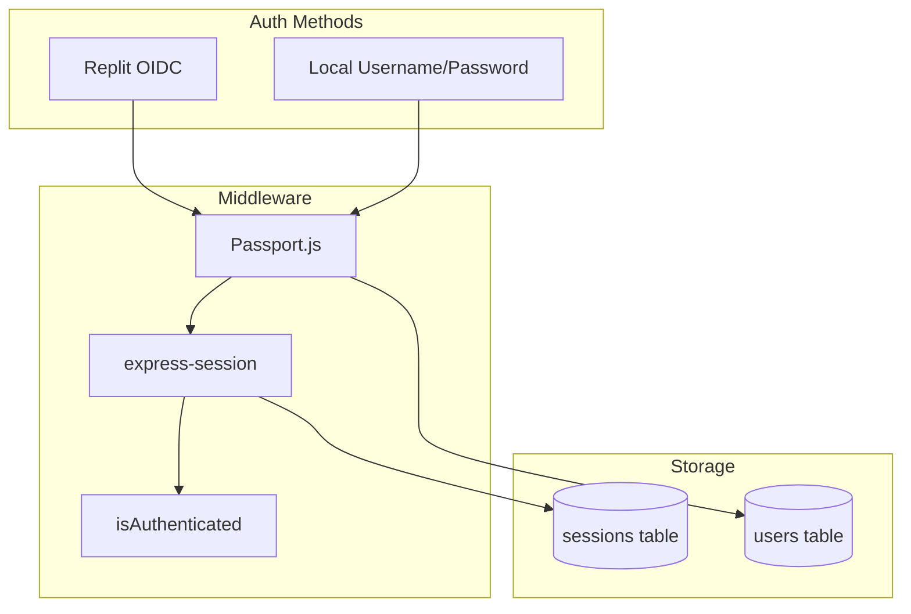
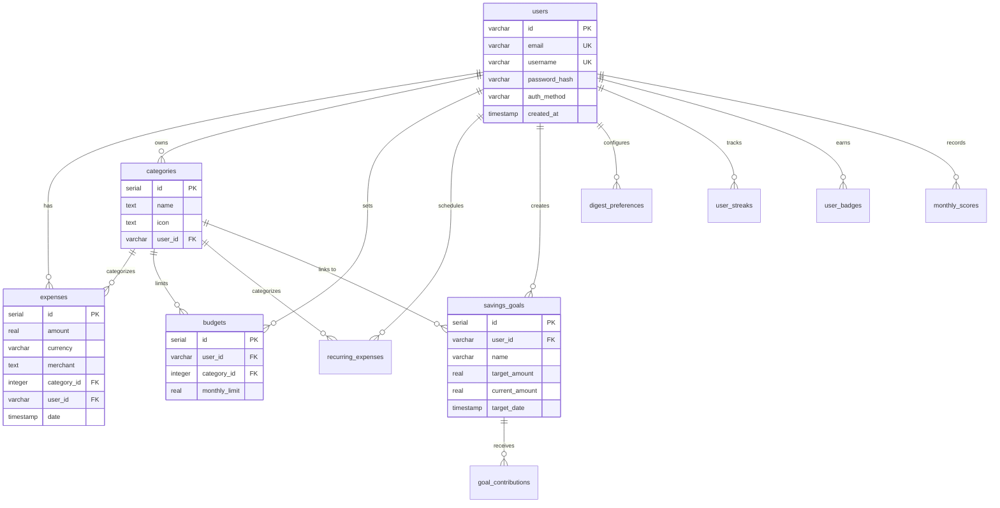
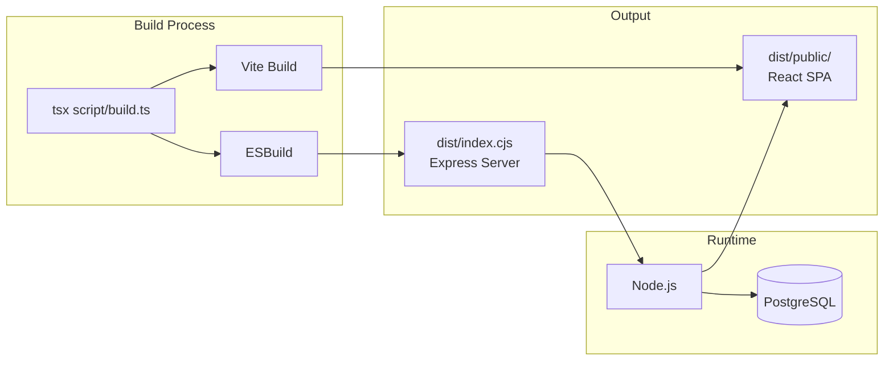

# Architecture Overview

> **Generated:** 2026-02-21 | **Part of:** [Technical Documentation](index.md)

## System Architecture

ExpenseTracker follows a **multi-part architecture** with clear separation between frontend, backend, and shared code.



## Component Architecture

### Frontend (React)

```mermaid
graph LR
    subgraph "Pages"
        Dashboard
        Expenses
        Analytics
        Categories
        Budgets
        Goals
        Badges
        AIRecommendations
    end

    subgraph "Components"
        ExpenseForm
        ExpenseList
        ReceiptUpload
        AnalyticsCharts
        StatCard
        StreakWidget
        BudgetScoreWidget
    end

    subgraph "Hooks"
        useAuth
        useCurrency
        useMobile
        useToast
        useOfflineQueue
    end

    subgraph "State"
        QueryClient[TanStack Query]
    end

    Pages --> Components
    Components --> Hooks
    Hooks --> QueryClient
```



### Backend (Express)

```mermaid
graph TB
    subgraph "Entry Point"
        Index[server/index.ts]
    end

    subgraph "Middleware"
        Session[express-session]
        Auth[replitAuth.ts]
        RateLimit[rateLimit.ts]
        Static[static.ts]
    end

    subgraph "Routes"
        Routes[routes.ts<br/>51 endpoints]
    end

    subgraph "Data Access"
        Storage[storage.ts]
        DB[db.ts]
    end

    subgraph "External"
        OpenAI[replit_integrations/]
        GitHub[github-client.ts]
    end

    Index --> Session
    Session --> Auth
    Auth --> RateLimit
    RateLimit --> Routes
    Routes --> Storage
    Storage --> DB
    Routes --> OpenAI
```

## Data Flow

### Expense Creation Flow



### Receipt Scanning Flow



## Security Architecture

### Authentication Flow



### Rate Limiting

| Limiter | Limit | Window | Scope |
|---------|-------|--------|-------|
| **Global** | 100 requests | 1 minute | Per IP |
| **AI Endpoints** | 5 requests | 1 minute | Per user |

**AI-Limited Endpoints:**
- `POST /api/ai/recommendations`
- `POST /api/receipt/scan`
- `POST /api/expenses/parse-natural`
- `POST /api/chat/expense-query`

## Database Architecture

### Entity Relationship Diagram



## Deployment Architecture

### Production Build



### Environment Variables

| Variable | Required | Description |
|----------|----------|-------------|
| `DATABASE_URL` | ✅ | PostgreSQL connection string |
| `OPENAI_API_KEY` | ✅ | OpenAI API key for GPT-4o |
| `SESSION_SECRET` | ⚪ | Session encryption key (auto-generated if missing) |
| `NODE_ENV` | ⚪ | `development` or `production` |

---

*[Back to Documentation Index](index.md)*
