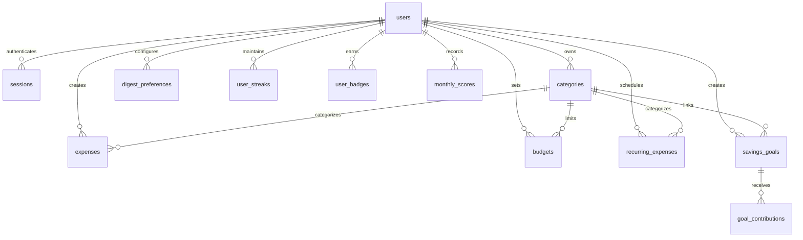

# Data Models

> **Generated:** 2026-02-21 | **Part of:** [Technical Documentation](index.md)

## Overview

ExpenseTracker uses **PostgreSQL 16** with **Drizzle ORM** for type-safe database operations. The schema is defined in [shared/schema.ts](../shared/schema.ts) and includes **11 tables** with Zod validation schemas.

## Entity Relationship Diagram



---

## Tables

### users

Core user table supporting both Replit OIDC and local authentication.

| Column | Type | Constraints | Description |
|--------|------|-------------|-------------|
| `id` | `varchar` | PK, default: `gen_random_uuid()` | Unique user identifier |
| `email` | `varchar` | UNIQUE, nullable | User email address |
| `username` | `varchar` | UNIQUE, nullable | Username for local auth |
| `password_hash` | `varchar` | nullable | Bcrypt hashed password |
| `auth_method` | `varchar` | default: `'oidc'` | `'oidc'` or `'local'` |
| `first_name` | `varchar` | nullable | First name |
| `last_name` | `varchar` | nullable | Last name |
| `profile_image_url` | `varchar` | nullable | Avatar URL |
| `created_at` | `timestamp` | default: `now()` | Account creation time |
| `updated_at` | `timestamp` | default: `now()` | Last update time |

---

### sessions

Session storage for express-session (required for Replit Auth).

| Column | Type | Constraints | Description |
|--------|------|-------------|-------------|
| `sid` | `varchar` | PK | Session ID |
| `sess` | `jsonb` | NOT NULL | Session data |
| `expire` | `timestamp` | NOT NULL, INDEXED | Expiration time |

---

### categories

Expense categories with customizable icons.

| Column | Type | Constraints | Description |
|--------|------|-------------|-------------|
| `id` | `serial` | PK | Auto-increment ID |
| `name` | `text` | NOT NULL | Category name |
| `icon` | `text` | NOT NULL, default: `'Shopping'` | Lucide icon name |
| `user_id` | `varchar` | FK → users.id | Owner |
| `created_at` | `timestamp` | NOT NULL | Creation time |

**Default Categories:** Groceries, Food, Transport, Housing, Utilities, Entertainment, Health, Education, Travel, Other

---

### expenses

Core expense tracking table.

| Column | Type | Constraints | Description |
|--------|------|-------------|-------------|
| `id` | `serial` | PK | Auto-increment ID |
| `amount` | `real` | NOT NULL | Expense amount |
| `currency` | `varchar(3)` | NOT NULL, default: `'PHP'` | ISO currency code |
| `description` | `text` | nullable | Optional description |
| `merchant` | `text` | NOT NULL | Merchant/payee name |
| `category_id` | `integer` | FK → categories.id | Category reference |
| `date` | `timestamp` | NOT NULL | Transaction date |
| `has_receipt` | `boolean` | default: `false` | Receipt attached flag |
| `receipt_url` | `text` | nullable | Receipt image URL |
| `user_id` | `varchar` | FK → users.id | Owner |
| `created_at` | `timestamp` | NOT NULL | Record creation time |

**Supported Currencies:**
```typescript
const CURRENCIES = ["USD", "EUR", "GBP", "JPY", "CAD", "AUD", "CHF", "CNY", "INR", "MXN", "PHP"] as const;
```

---

### budgets

Monthly spending limits per category.

| Column | Type | Constraints | Description |
|--------|------|-------------|-------------|
| `id` | `serial` | PK | Auto-increment ID |
| `user_id` | `varchar` | FK → users.id, NOT NULL | Owner |
| `category_id` | `integer` | FK → categories.id, NOT NULL | Target category |
| `monthly_limit` | `real` | NOT NULL | Monthly budget amount |
| `created_at` | `timestamp` | NOT NULL | Creation time |

**Unique Constraint:** `(user_id, category_id)` - One budget per category per user

---

### recurring_expenses

Subscription and recurring payment tracking.

| Column | Type | Constraints | Description |
|--------|------|-------------|-------------|
| `id` | `serial` | PK | Auto-increment ID |
| `user_id` | `varchar` | FK → users.id, NOT NULL | Owner |
| `amount` | `real` | NOT NULL | Recurring amount |
| `currency` | `varchar(3)` | NOT NULL, default: `'PHP'` | ISO currency code |
| `merchant` | `text` | NOT NULL | Merchant name |
| `description` | `text` | nullable | Optional description |
| `category_id` | `integer` | FK → categories.id | Category reference |
| `frequency` | `text` | NOT NULL | `daily`, `weekly`, `monthly`, `yearly` |
| `start_date` | `timestamp` | NOT NULL | First occurrence |
| `end_date` | `timestamp` | nullable | Optional end date |
| `last_generated_date` | `timestamp` | nullable | Last auto-generation |
| `is_active` | `boolean` | NOT NULL, default: `true` | Active/paused status |
| `created_at` | `timestamp` | NOT NULL | Creation time |

---

### digest_preferences

Email digest configuration.

| Column | Type | Constraints | Description |
|--------|------|-------------|-------------|
| `id` | `serial` | PK | Auto-increment ID |
| `user_id` | `varchar` | FK → users.id, NOT NULL | Owner |
| `enabled` | `boolean` | NOT NULL, default: `false` | Digest enabled |
| `frequency` | `text` | NOT NULL, default: `'weekly'` | `daily` or `weekly` |
| `include_categories` | `boolean` | NOT NULL, default: `true` | Include breakdown |
| `include_budget_alerts` | `boolean` | NOT NULL, default: `true` | Include alerts |
| `include_top_merchants` | `boolean` | NOT NULL, default: `true` | Include merchants |
| `email` | `varchar` | nullable | Recipient email |
| `last_sent_at` | `timestamp` | nullable | Last send time |
| `created_at` | `timestamp` | NOT NULL | Creation time |

**Unique Constraint:** `(user_id)` - One preference per user

---

### savings_goals

Financial goal tracking.

| Column | Type | Constraints | Description |
|--------|------|-------------|-------------|
| `id` | `serial` | PK | Auto-increment ID |
| `user_id` | `varchar` | FK → users.id, NOT NULL | Owner |
| `name` | `varchar(100)` | NOT NULL | Goal name |
| `target_amount` | `real` | NOT NULL | Target amount |
| `current_amount` | `real` | NOT NULL, default: `0` | Current progress |
| `target_date` | `timestamp` | NOT NULL | Target completion date |
| `icon` | `varchar(50)` | default: `'🎯'` | Emoji icon |
| `color` | `varchar(7)` | default: `'#3B82F6'` | Hex color code |
| `linked_category_id` | `integer` | FK → categories.id | Optional category link |
| `created_at` | `timestamp` | NOT NULL | Creation time |

---

### goal_contributions

Individual contributions to savings goals.

| Column | Type | Constraints | Description |
|--------|------|-------------|-------------|
| `id` | `serial` | PK | Auto-increment ID |
| `goal_id` | `integer` | FK → savings_goals.id, ON DELETE CASCADE | Target goal |
| `amount` | `real` | NOT NULL | Contribution amount |
| `note` | `text` | nullable | Optional note |
| `created_at` | `timestamp` | NOT NULL | Contribution time |

---

### user_streaks

Daily expense logging streak tracking.

| Column | Type | Constraints | Description |
|--------|------|-------------|-------------|
| `id` | `serial` | PK | Auto-increment ID |
| `user_id` | `varchar` | FK → users.id, NOT NULL | Owner |
| `current_streak` | `integer` | NOT NULL, default: `0` | Current streak days |
| `longest_streak` | `integer` | NOT NULL, default: `0` | All-time best |
| `last_expense_date` | `timestamp` | nullable | Last logged expense |
| `streak_freezes_used` | `integer` | NOT NULL, default: `0` | Freezes consumed |
| `updated_at` | `timestamp` | NOT NULL | Last update time |

**Unique Constraint:** `(user_id)`

---

### user_badges

Achievement badges earned by users.

| Column | Type | Constraints | Description |
|--------|------|-------------|-------------|
| `id` | `serial` | PK | Auto-increment ID |
| `user_id` | `varchar` | FK → users.id, NOT NULL | Owner |
| `badge_key` | `varchar(50)` | NOT NULL | Badge identifier |
| `unlocked_at` | `timestamp` | NOT NULL | Unlock time |

**Unique Constraint:** `(user_id, badge_key)` - One badge per user

---

### monthly_scores

Monthly budget adherence scores.

| Column | Type | Constraints | Description |
|--------|------|-------------|-------------|
| `id` | `serial` | PK | Auto-increment ID |
| `user_id` | `varchar` | FK → users.id, NOT NULL | Owner |
| `year` | `integer` | NOT NULL | Score year |
| `month` | `integer` | NOT NULL | Score month (1-12) |
| `score` | `real` | NOT NULL | Score (0-100) |
| `breakdown` | `jsonb` | NOT NULL | Category breakdown |
| `calculated_at` | `timestamp` | NOT NULL | Calculation time |

**Unique Constraint:** `(user_id, year, month)` - One score per month per user

**Breakdown Schema:**
```typescript
interface CategoryScoreBreakdown {
  categoryId: number;
  categoryName: string;
  categoryIcon: string;
  budget: number;
  spent: number;
  score: number;
  weight: number;
}
```

---

## Zod Validation Schemas

All insert schemas are generated from Drizzle tables using `drizzle-zod` with additional constraints:

| Schema | Key Validations |
|--------|-----------------|
| `insertCategorySchema` | name: 1-100 chars |
| `insertExpenseSchema` | amount: positive, max 999M; merchant: 1-200 chars |
| `insertBudgetSchema` | monthlyLimit: positive, max 999M |
| `insertRecurringExpenseSchema` | frequency: enum validation |
| `insertSavingsGoalSchema` | targetAmount: positive; name: 1-100 chars |
| `insertDigestPreferencesSchema` | email: email format; frequency: enum |
| `registerUserSchema` | username: 3+ chars; password: 6+ chars |
| `loginUserSchema` | username & password required |

---

## Database Connection

```typescript
// server/db.ts
import { drizzle } from "drizzle-orm/node-postgres";
import pg from "pg";

const pool = new pg.Pool({
  connectionString: process.env.DATABASE_URL
});

export const db = drizzle(pool);
```

## Migrations

```bash
# Push schema changes to database
npm run db:push

# Or use Drizzle Kit
npx drizzle-kit push
```

---

*[Back to Documentation Index](index.md)*
