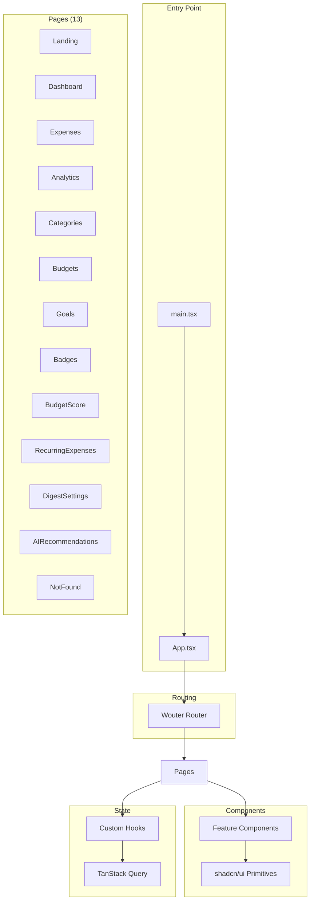

# Frontend Components

> **Generated:** 2026-02-21 | **Part of:** [Technical Documentation](index.md)

## Overview

The React frontend is organized into **13 pages**, **16+ custom components**, and leverages **shadcn/ui** (Radix primitives) for consistent UI patterns.

## Architecture



---

## Pages

| Page | Route | Description |
|------|-------|-------------|
| `Landing.tsx` | `/` | Public landing page with auth |
| `Dashboard.tsx` | `/dashboard` | Main dashboard with stats |
| `Expenses.tsx` | `/expenses` | Expense list with CRUD |
| `Analytics.tsx` | `/analytics` | Charts and reports |
| `Categories.tsx` | `/categories` | Category management |
| `Budgets.tsx` | `/budgets` | Budget configuration |
| `Goals.tsx` | `/goals` | Savings goals |
| `Badges.tsx` | `/badges` | Achievement badges |
| `BudgetScore.tsx` | `/budget-score` | Monthly score details |
| `RecurringExpenses.tsx` | `/recurring` | Recurring expenses |
| `DigestSettings.tsx` | `/digest` | Email digest config |
| `AIRecommendations.tsx` | `/ai` | AI spending insights |
| `not-found.tsx` | `*` | 404 page |

---

## Feature Components

### ExpenseForm.tsx
Full-featured expense input form with validation.

**Features:**
- Amount input with currency selector
- Merchant autocomplete
- Category dropdown
- Date picker
- Receipt upload trigger
- Zod validation with react-hook-form

**Props:** Standard form props with onSubmit callback

---

### ExpenseList.tsx
Paginated expense list with filtering.

**Features:**
- Server-side pagination (20 per page)
- Date range filtering
- Category filtering
- Search across merchant/description
- Delete with confirmation dialog

---

### ExpenseItem.tsx
Individual expense row/card component.

**Features:**
- Formatted amount with currency symbol
- Category badge with icon
- Date formatting
- Edit/delete actions

---

### ReceiptUpload.tsx
AI-powered receipt scanning component.

**Features:**
- Image upload (camera or file)
- Base64 encoding for API
- Loading state during GPT-4o processing
- Auto-fill form with extracted data
- Error handling for failed scans

---

### AnalyticsCharts.tsx
Collection of Recharts visualizations.

**Charts Included:**
- Category spending pie chart
- Spending trend line chart (30-day)
- Weekly breakdown bar chart
- Monthly comparison

---

### StatCard.tsx
Dashboard statistic card component.

**Variants:**
- Total spending
- This month
- This week
- Daily average
- Trend indicators (up/down arrows)

---

### CategoryManagement.tsx
Category CRUD interface.

**Features:**
- Add new category with icon picker
- Edit existing categories
- Delete with expense reassignment warning
- Icon selection from Lucide library

---

### CategoryBadge.tsx
Colored badge showing category with icon.

**Props:**
```typescript
interface Props {
  name: string;
  icon: string;
  variant?: 'default' | 'outline';
}
```

---

### CurrencySelector.tsx
Currency dropdown with symbol display.

**Supports:** USD, EUR, GBP, JPY, CAD, AUD, CHF, CNY, INR, MXN, PHP

---

### DateRangePicker.tsx
Date range selection with presets.

**Presets:**
- Last 7 days
- Last 30 days
- This month
- Last month
- This year
- Custom range

---

### AppSidebar.tsx
Main navigation sidebar.

**Features:**
- Responsive (mobile drawer)
- Active route highlighting
- User profile section
- Theme toggle integration

---

### ThemeToggle.tsx
Dark/light mode switcher.

**Uses:** `next-themes` provider

---

### StreakWidget.tsx
Gamification streak display.

**Shows:**
- Current streak with fire emoji
- Longest streak record
- Days since last expense

---

### BudgetScoreWidget.tsx
Monthly budget score summary.

**Shows:**
- Overall score (0-100)
- Score breakdown by category
- Progress bars with color coding

---

### NaturalLanguageExpenseInput.tsx
AI-powered natural language expense entry.

**Example Input:** "Spent $45 at Target yesterday for groceries"

**Features:**
- Text input with AI parsing
- Confidence display
- One-click confirm to create expense

---

### ExpenseChat.tsx
Conversational expense query interface.

**Features:**
- Chat-style UI
- Query expenses in natural language
- AI-generated insights

---

## Custom Hooks

### useAuth.ts
Authentication state management.

```typescript
function useAuth(): {
  user: User | null;
  isLoading: boolean;
  isAuthenticated: boolean;
  login: () => void;
  logout: () => void;
}
```

### useCurrency.tsx
Currency formatting and conversion.

```typescript
function useCurrency(): {
  formatAmount: (amount: number, currency: Currency) => string;
  convertAmount: (amount: number, from: Currency, to: Currency) => number;
  exchangeRates: Record<Currency, number>;
  baseCurrency: Currency;
}
```

### useMobile.tsx
Responsive breakpoint detection.

```typescript
function useMobile(): boolean; // true if mobile viewport
```

### useToast.ts
Toast notification system (shadcn/ui toast).

```typescript
function useToast(): {
  toast: (options: ToastOptions) => void;
  dismiss: (id?: string) => void;
  toasts: Toast[];
}
```

### useOfflineQueue.ts
Offline-first expense queuing.

```typescript
function useOfflineQueue(): {
  queueExpense: (expense: InsertExpense) => void;
  pendingCount: number;
  syncQueue: () => Promise<void>;
}
```

---

## UI Components (shadcn/ui)

The project uses the **shadcn/ui** component library built on Radix primitives.

### Installed Components

| Component | Usage |
|-----------|-------|
| `Accordion` | Collapsible sections |
| `Alert Dialog` | Confirmation dialogs |
| `Avatar` | User avatars |
| `Button` | Primary actions |
| `Card` | Content containers |
| `Checkbox` | Form checkboxes |
| `Dialog` | Modal dialogs |
| `Dropdown Menu` | Action menus |
| `Form` | Form validation |
| `Input` | Text inputs |
| `Label` | Form labels |
| `Popover` | Floating content |
| `Progress` | Progress bars |
| `Select` | Dropdown selects |
| `Separator` | Visual dividers |
| `Sheet` | Mobile drawers |
| `Skeleton` | Loading states |
| `Slider` | Range inputs |
| `Switch` | Toggle switches |
| `Tabs` | Tab navigation |
| `Toast` | Notifications |
| `Tooltip` | Help tooltips |

### Configuration

Components are configured in `components.json`:
```json
{
  "style": "default",
  "tailwind": {
    "config": "tailwind.config.ts",
    "css": "client/src/index.css"
  },
  "aliases": {
    "components": "@/components",
    "utils": "@/lib/utils"
  }
}
```

---

## State Management

### TanStack Query

All server state is managed via TanStack Query with automatic caching and invalidation.

**Query Client Config:**
```typescript
// client/src/lib/queryClient.ts
const queryClient = new QueryClient({
  defaultOptions: {
    queries: {
      staleTime: 1000 * 60 * 5, // 5 minutes
      retry: 1,
    },
  },
});
```

### Key Query Keys

| Key | Endpoint | Description |
|-----|----------|-------------|
| `['categories']` | `/api/categories` | User categories |
| `['expenses']` | `/api/expenses` | Paginated expenses |
| `['budgets']` | `/api/budgets` | Budget list |
| `['budget-progress']` | `/api/budgets/progress` | Budget with spending |
| `['goals']` | `/api/goals` | Savings goals |
| `['streak']` | `/api/streak` | User streak |
| `['badges']` | `/api/badges` | Earned badges |
| `['analytics', 'summary']` | `/api/analytics/summary-stats` | Dashboard stats |

---

## Styling

### Tailwind CSS 4

```typescript
// tailwind.config.ts
export default {
  darkMode: 'class',
  content: ['./client/src/**/*.{ts,tsx}'],
  theme: {
    extend: {
      colors: {
        // CSS variables for theming
      }
    }
  },
  plugins: [
    require('tailwindcss-animate'),
    require('@tailwindcss/typography')
  ]
}
```

### CSS Variables

Theme colors defined in `client/src/index.css`:
- `--background`
- `--foreground`
- `--primary`
- `--secondary`
- `--muted`
- `--accent`
- `--destructive`

---

## File Structure

```
client/src/
├── App.tsx              # Root component with routing
├── main.tsx             # Entry point with providers
├── index.css            # Global styles & CSS vars
├── components/
│   ├── ui/              # shadcn/ui primitives
│   │   ├── button.tsx
│   │   ├── card.tsx
│   │   └── ...
│   ├── ExpenseForm.tsx
│   ├── ExpenseList.tsx
│   ├── ExpenseItem.tsx
│   ├── ReceiptUpload.tsx
│   ├── AnalyticsCharts.tsx
│   ├── StatCard.tsx
│   ├── CategoryManagement.tsx
│   ├── CategoryBadge.tsx
│   ├── CurrencySelector.tsx
│   ├── DateRangePicker.tsx
│   ├── AppSidebar.tsx
│   ├── ThemeToggle.tsx
│   ├── StreakWidget.tsx
│   ├── BudgetScoreWidget.tsx
│   ├── NaturalLanguageExpenseInput.tsx
│   └── ExpenseChat.tsx
├── hooks/
│   ├── useAuth.ts
│   ├── useCurrency.tsx
│   ├── use-mobile.tsx
│   ├── use-toast.ts
│   └── useOfflineQueue.ts
├── lib/
│   ├── queryClient.ts
│   ├── utils.ts
│   └── authUtils.ts
└── pages/
    ├── Landing.tsx
    ├── Dashboard.tsx
    ├── Expenses.tsx
    ├── Analytics.tsx
    ├── Categories.tsx
    ├── Budgets.tsx
    ├── Goals.tsx
    ├── Badges.tsx
    ├── BudgetScore.tsx
    ├── RecurringExpenses.tsx
    ├── DigestSettings.tsx
    ├── AIRecommendations.tsx
    └── not-found.tsx
```

---

*[Back to Documentation Index](index.md)*
